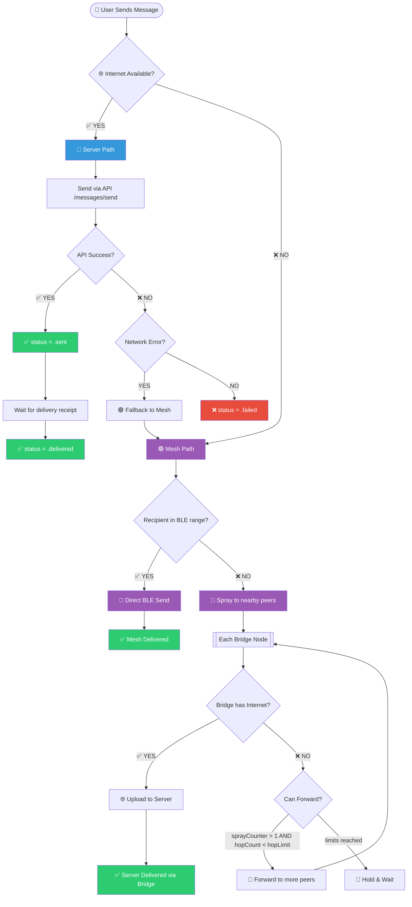
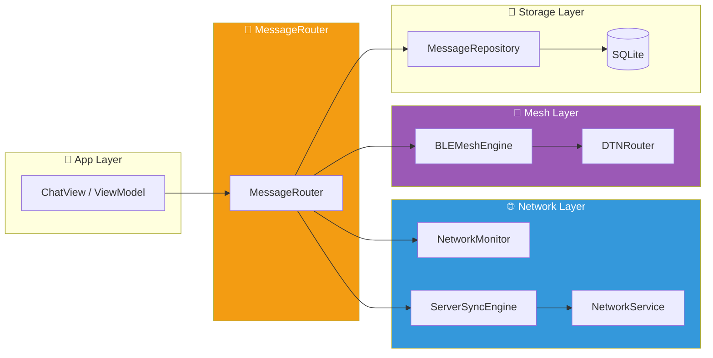

# DTN Mesh Implementation Guide - iOS Native (Swift)

> **Version**: 1.0  
> **Target**: Swift/SwiftUI iOS App  
> **Purpose**: Complete implementation guide for Server-first, Mesh-fallback hybrid messaging

---

## 0. Source of Truth — Delivery Behavior



### Summary Rules

| Condition | Action |
|-----------|--------|
| Internet available | Send via Server → Blue indicator 🔵 |
| No Internet, recipient nearby | Direct BLE → Purple indicator 🟣 |
| No Internet, recipient not nearby | Relay (Spray) to peers → each Bridge checks Internet |
| Bridge has Internet | Upload to Server (Idempotent) |
| Bridge no Internet | Forward with DTN algorithm |

---

## 1. Data Model — Required Fields for DTN

### 1.1 MessageStatus Enum

```swift
enum MessageStatus: String, Codable, CaseIterable {
    case pending      // Queued locally
    case sending      // Upload/send in progress
    case forwarding   // Mesh relay in progress
    case sent         // Server confirmed receipt
    case delivered    // Recipient device received
    case read         // Recipient opened chat
    case failed       // Delivery failed
    case scheduled    // Waiting for scheduled time
}
```

### 1.2 DeliveryAuthority Enum

```swift
enum DeliveryAuthority: String, Codable {
    case server  // Blue indicator - 🔵
    case mesh    // Purple indicator - 🟣
    
    var indicatorColor: Color {
        switch self {
        case .server: return .blue
        case .mesh: return Color.purple
        }
    }
}
```

### 1.3 SyncState Enum

```swift
enum SyncState: String, Codable {
    case localOnly   // Never synced to server
    case queued      // Waiting to sync
    case uploading   // Sync in progress
    case synced      // Successfully synced
    case failed      // Sync failed, retry needed
}
```

### 1.4 ChatMessage Model — Complete DTN Fields

```swift
struct ChatMessage: Identifiable, Codable {
    // MARK: - Core Identifiers (CRITICAL for Idempotency)
    let id: String              // Client Message ID (UUID) — NEVER CHANGES
    var serverId: String?       // Server-assigned ID (set after upload)
    
    // MARK: - Routing Info
    let roomId: String
    let senderId: String
    let senderName: String
    let recipientId: String
    
    // MARK: - Content
    let text: String?
    let timestamp: Date
    let type: MessageType
    var status: MessageStatus
    var deliveryAuthority: DeliveryAuthority
    
    // MARK: - DTN/Mesh Fields (REQUIRED for routing)
    var sprayCounter: Int       // Copies remaining (starts at 5)
    var hopCount: Int           // Current hop number (starts at 0)
    var hopLimit: Int           // Max hops allowed (default 10)
    var routePath: [String]     // Device IDs that handled this message
    let originDeviceId: String  // Device that created the message
    var needsForwarding: Bool   // Should this be relayed?
    
    // MARK: - Sync State
    var syncState: SyncState
    var localPath: String?      // Local file path for attachments
    
    // MARK: - Timestamps
    let createdAt: Date
    var deliveredAt: Date?
    var readAt: Date?
    
    // MARK: - Media Attachment (optional)
    var attachmentUrl: String?
    var thumbnailUrl: String?
    let fileName: String?
    let mimeType: String?
    let fileSize: Int?
    let audioDurationSeconds: Int?
    
    // MARK: - Reply (optional)
    let replyToMessageId: String?
    let replyToTextPreview: String?
    let replyToSenderName: String?
    
    // MARK: - Scheduled (optional)
    let scheduledAtUtc: Date?
}
```

### 1.5 Database Schema (SQLite)

```sql
CREATE TABLE messages (
    -- Client ID is PRIMARY KEY and UNIQUE for duplicate prevention
    id TEXT PRIMARY KEY,                    -- client_message_id (UUID)
    server_id TEXT UNIQUE,                  -- NULL until server confirms
    
    room_id TEXT NOT NULL,
    sender_id TEXT NOT NULL,
    sender_name TEXT NOT NULL,
    recipient_id TEXT NOT NULL,
    
    text TEXT,
    timestamp INTEGER NOT NULL,
    type TEXT NOT NULL,
    status TEXT NOT NULL DEFAULT 'pending',
    delivery_authority TEXT NOT NULL DEFAULT 'server',
    
    -- DTN Fields
    spray_counter INTEGER NOT NULL DEFAULT 5,
    hop_count INTEGER NOT NULL DEFAULT 0,
    hop_limit INTEGER NOT NULL DEFAULT 10,
    route_path TEXT,                        -- JSON array of device IDs
    origin_device_id TEXT NOT NULL,
    needs_forwarding INTEGER NOT NULL DEFAULT 0,
    
    -- Sync
    sync_state TEXT NOT NULL DEFAULT 'localOnly',
    local_path TEXT,
    
    -- Timestamps
    created_at INTEGER NOT NULL,
    delivered_at INTEGER,
    read_at INTEGER,
    
    -- Media
    attachment_url TEXT,
    thumbnail_url TEXT,
    file_name TEXT,
    mime_type TEXT,
    file_size INTEGER,
    audio_duration INTEGER,
    
    -- Reply
    reply_to_message_id TEXT,
    reply_to_text_preview TEXT,
    reply_to_sender_name TEXT,
    
    -- Scheduled
    scheduled_at_utc INTEGER
);

-- Critical indexes for deduplication
CREATE UNIQUE INDEX idx_messages_client_id ON messages(id);
CREATE UNIQUE INDEX idx_messages_server_id ON messages(server_id) WHERE server_id IS NOT NULL;
CREATE INDEX idx_messages_room_timestamp ON messages(room_id, timestamp);
CREATE INDEX idx_messages_needs_forwarding ON messages(needs_forwarding) WHERE needs_forwarding = 1;
```

---

## 2. Core Engines Architecture



### 2.1 NetworkMonitor

```swift
import Network
import Combine

final class NetworkMonitor: ObservableObject {
    static let shared = NetworkMonitor()
    
    @Published private(set) var isOnline: Bool = false
    @Published private(set) var connectionType: NWInterface.InterfaceType?
    
    private let monitor = NWPathMonitor()
    private let queue = DispatchQueue(label: "com.raven.networkmonitor")
    
    private init() {}
    
    func start() {
        monitor.pathUpdateHandler = { [weak self] path in
            DispatchQueue.main.async {
                self?.isOnline = (path.status == .satisfied)
                self?.connectionType = path.availableInterfaces.first?.type
            }
        }
        monitor.start(queue: queue)
    }
    
    func stop() {
        monitor.cancel()
    }
}
```

### 2.2 DeviceIdProvider

```swift
import UIKit

final class DeviceIdProvider {
    static let shared = DeviceIdProvider()
    
    // This should be a stable identifier persisted in Keychain
    lazy var deviceId: String = {
        if let stored = KeychainService.shared.getString(for: "device_id") {
            return stored
        }
        let newId = UUID().uuidString
        KeychainService.shared.set(newId, for: "device_id")
        return newId
    }()
    
    private init() {}
}
```

---

## 3. MessageRouter — The Core Logic

```swift
import Foundation
import Combine

final class MessageRouter: ObservableObject {
    static let shared = MessageRouter()
    
    private let network = NetworkMonitor.shared
    private let api = NetworkService.shared
    private let repo = MessageRepository.shared
    private let mesh = BLEMeshEngine.shared
    private let deviceId = DeviceIdProvider.shared.deviceId
    private var cancellables = Set<AnyCancellable>()
    
    private init() {
        observeNetworkChanges()
    }
    
    // MARK: - Send Text Message
    
    func sendText(roomId: String, recipientId: String, text: String) async {
        let msg = createOutgoingMessage(
            roomId: roomId,
            recipientId: recipientId,
            text: text,
            type: .text
        )
        
        // 1) Insert locally first (optimistic)
        await repo.insertLocal(msg)
        
        // 2) Route based on connectivity
        if network.isOnline {
            await sendViaServerOrFallbackToMesh(msg)
        } else {
            await sendViaMesh(msg)
        }
    }
    
    // MARK: - Server Path (Blue)
    
    private func sendViaServerOrFallbackToMesh(_ msg: ChatMessage) async {
        var updated = msg
        updated.deliveryAuthority = .server
        updated.status = .sending
        await repo.updateStatus(id: msg.id, status: .sending, authority: .server)
        
        do {
            // ⚠️ CRITICAL: Idempotency-Key MUST be client_message_id
            let response = try await api.sendMessage(msg, idempotencyKey: msg.id)
            await repo.markServerSynced(localId: msg.id, serverId: response.serverId, status: .sent)
            print("✅ [Router] Message \(msg.id) sent via server")
        } catch {
            print("❌ [Router] Server send failed: \(error)")
            // Fallback to mesh if network error
            if !network.isOnline {
                await sendViaMesh(msg)
            } else {
                await repo.updateStatus(id: msg.id, status: .failed, authority: .server)
            }
        }
    }
    
    // MARK: - Mesh Path (Purple)
    
    private func sendViaMesh(_ msg: ChatMessage) async {
        var updated = msg
        updated.deliveryAuthority = .mesh
        updated.status = .forwarding
        updated.sprayCounter = 5      // Initial spray copies
        updated.hopLimit = 10         // Max hops
        updated.hopCount = 0          // Starting hop
        updated.routePath = [deviceId] // We originated it
        updated.needsForwarding = true
        
        await repo.updateForMeshStart(updated)
        print("🟣 [Router] Message \(msg.id) routing via Mesh")
        
        await mesh.enqueueForBroadcast(updated.toMeshEnvelope())
    }
    
    // MARK: - Factory
    
    private func createOutgoingMessage(
        roomId: String,
        recipientId: String,
        text: String,
        type: MessageType
    ) -> ChatMessage {
        let authService = AuthService.shared // Get current user
        return ChatMessage(
            id: UUID().uuidString,
            serverId: nil,
            roomId: roomId,
            senderId: authService.currentUserId ?? "",
            senderName: authService.currentUser?.displayName ?? "",
            recipientId: recipientId,
            text: text,
            timestamp: Date(),
            type: type,
            status: .pending,
            deliveryAuthority: .server, // Default, may change
            sprayCounter: 5,
            hopCount: 0,
            hopLimit: 10,
            routePath: [deviceId],
            originDeviceId: deviceId,
            needsForwarding: false,
            syncState: .localOnly,
            localPath: nil,
            createdAt: Date(),
            deliveredAt: nil,
            readAt: nil,
            attachmentUrl: nil,
            thumbnailUrl: nil,
            fileName: nil,
            mimeType: nil,
            fileSize: nil,
            audioDurationSeconds: nil,
            replyToMessageId: nil,
            replyToTextPreview: nil,
            replyToSenderName: nil,
            scheduledAtUtc: nil
        )
    }
    
    // MARK: - Network Reconnection Handler
    
    private func observeNetworkChanges() {
        network.$isOnline
            .removeDuplicates()
            .sink { [weak self] isOnline in
                if isOnline {
                    Task { await self?.syncPendingMessages() }
                }
            }
            .store(in: &cancellables)
    }
    
    private func syncPendingMessages() async {
        let pending = await repo.getPendingMeshMessages()
        for msg in pending {
            // Try to upload any mesh messages that haven't synced
            if msg.deliveryAuthority == .mesh && msg.syncState != .synced {
                do {
                    let response = try await api.sendMessage(msg, idempotencyKey: msg.id)
                    await repo.markServerSynced(localId: msg.id, serverId: response.serverId, status: .sent)
                    print("✅ [Router] Synced pending mesh message \(msg.id)")
                } catch {
                    print("⚠️ [Router] Failed to sync \(msg.id): \(error)")
                }
            }
        }
    }
}
```

---

## 4. MeshEnvelope — BLE Payload

```swift
/// Compact envelope for BLE transmission
struct MeshEnvelope: Codable {
    let clientMessageId: String
    let roomId: String
    let senderId: String
    let recipientId: String
    
    let type: Int  // MessageType raw value
    let text: String?
    
    // DTN Controls
    var sprayCounter: Int
    var hopCount: Int
    var hopLimit: Int
    var routePath: [String]
    let originDeviceId: String
    var needsForwarding: Bool
    
    // For media (optional)
    var mediaUrl: String?
}

extension ChatMessage {
    func toMeshEnvelope() -> MeshEnvelope {
        MeshEnvelope(
            clientMessageId: id,
            roomId: roomId,
            senderId: senderId,
            recipientId: recipientId,
            type: type.rawValue,
            text: text,
            sprayCounter: sprayCounter,
            hopCount: hopCount,
            hopLimit: hopLimit,
            routePath: routePath,
            originDeviceId: originDeviceId,
            needsForwarding: needsForwarding,
            mediaUrl: attachmentUrl
        )
    }
    
    static func fromMeshEnvelope(_ env: MeshEnvelope, authority: DeliveryAuthority = .mesh) -> ChatMessage {
        ChatMessage(
            id: env.clientMessageId,
            serverId: nil,
            roomId: env.roomId,
            senderId: env.senderId,
            senderName: "", // Will be resolved from DB
            recipientId: env.recipientId,
            text: env.text,
            timestamp: Date(),
            type: MessageType(rawValue: env.type) ?? .text,
            status: .delivered,
            deliveryAuthority: authority,
            sprayCounter: env.sprayCounter,
            hopCount: env.hopCount,
            hopLimit: env.hopLimit,
            routePath: env.routePath,
            originDeviceId: env.originDeviceId,
            needsForwarding: env.needsForwarding,
            syncState: .localOnly,
            localPath: nil,
            createdAt: Date(),
            deliveredAt: Date(),
            readAt: nil,
            attachmentUrl: env.mediaUrl,
            thumbnailUrl: nil,
            fileName: nil,
            mimeType: nil,
            fileSize: nil,
            audioDurationSeconds: nil,
            replyToMessageId: nil,
            replyToTextPreview: nil,
            replyToSenderName: nil,
            scheduledAtUtc: nil
        )
    }
}
```

---

## 5. Incoming Mesh Handler — Bridge Logic

```swift
extension MessageRouter {
    
    /// Handle incoming mesh message from BLE
    func handleIncomingMesh(_ envelope: MeshEnvelope) async {
        let myDeviceId = DeviceIdProvider.shared.deviceId
        let myUserId = AuthService.shared.currentUserId ?? ""
        
        // RULE 1: Duplicate Prevention (Hard Stop)
        if await repo.exists(clientMessageId: envelope.clientMessageId) {
            print("🚫 [Router] Duplicate message \(envelope.clientMessageId) - ignoring")
            return
        }
        
        // RULE 2: Loop Prevention
        if envelope.routePath.contains(myDeviceId) {
            print("🔄 [Router] Loop detected - my device in routePath - ignoring")
            return
        }
        
        // RULE 3: Hop Limit Check
        if envelope.hopCount >= envelope.hopLimit {
            print("⏹️ [Router] Hop limit reached (\(envelope.hopCount)/\(envelope.hopLimit)) - dropping")
            return
        }
        
        // RULE 4: Spray Counter Check
        if envelope.sprayCounter <= 0 {
            print("⏹️ [Router] Spray counter exhausted - dropping")
            return
        }
        
        // Store the incoming message
        let message = ChatMessage.fromMeshEnvelope(envelope, authority: .mesh)
        await repo.insertLocal(message)
        print("📥 [Router] Received mesh message \(envelope.clientMessageId)")
        
        // RULE 5: Am I the recipient?
        if envelope.recipientId == myUserId {
            await repo.updateStatus(id: envelope.clientMessageId, status: .delivered, authority: .mesh)
            print("✅ [Router] Message is for me - delivered!")
            // Notify UI
            NotificationCenter.default.post(
                name: .newMessageReceived,
                object: nil,
                userInfo: ["messageId": envelope.clientMessageId]
            )
            return
        }
        
        // RULE 6: I'm a Bridge - Decide: Upload or Forward
        if NetworkMonitor.shared.isOnline {
            await tryUploadToServerAsBridge(envelope)
        } else {
            await forwardToPeers(envelope)
        }
    }
    
    // MARK: - Bridge Upload (Idempotent)
    
    private func tryUploadToServerAsBridge(_ envelope: MeshEnvelope) async {
        print("🌉 [Router] Acting as Bridge - uploading to server")
        
        let message = ChatMessage.fromMeshEnvelope(envelope)
        
        do {
            // ⚠️ CRITICAL: Same idempotency key as original
            let response = try await api.sendMessage(message, idempotencyKey: envelope.clientMessageId)
            await repo.markBridgeUploaded(clientMessageId: envelope.clientMessageId)
            print("✅ [Router] Bridge upload successful for \(envelope.clientMessageId)")
        } catch {
            print("❌ [Router] Bridge upload failed: \(error)")
            // Queue for retry or continue forwarding
            await repo.markQueuedForRetry(clientMessageId: envelope.clientMessageId)
            // Also try forwarding since we couldn't bridge
            await forwardToPeers(envelope)
        }
    }
    
    // MARK: - Spray & Wait Forwarding
    
    private func forwardToPeers(_ envelope: MeshEnvelope) async {
        var forwardEnv = envelope
        forwardEnv.hopCount += 1
        forwardEnv.sprayCounter -= 1
        forwardEnv.routePath.append(DeviceIdProvider.shared.deviceId)
        
        // Check limits after update
        if forwardEnv.sprayCounter <= 0 {
            print("⏹️ [Router] No more spray copies left - holding")
            return
        }
        
        if forwardEnv.hopCount >= forwardEnv.hopLimit {
            print("⏹️ [Router] Hop limit would be exceeded - holding")
            return
        }
        
        // Get connected peers, excluding those already in routePath
        let allPeers = await mesh.getConnectedPeers()
        let eligiblePeers = allPeers.filter { !forwardEnv.routePath.contains($0.deviceId) }
        
        if eligiblePeers.isEmpty {
            print("📭 [Router] No eligible peers to forward to - holding message")
            return
        }
        
        // Spray to first N eligible peers (tune N based on scenario)
        let relayCount = min(2, eligiblePeers.count)
        let selectedPeers = Array(eligiblePeers.prefix(relayCount))
        
        for peer in selectedPeers {
            await mesh.send(forwardEnv, to: peer)
            print("📤 [Router] Forwarded to peer \(peer.deviceId)")
        }
        
        print("🔀 [Router] Forwarded message to \(relayCount) peers")
    }
}

// MARK: - Notification Names

extension Notification.Name {
    static let newMessageReceived = Notification.Name("newMessageReceived")
}
```

---

## 6. Server Sync Engine — Reconnection Retry

```swift
final class ServerSyncEngine: ObservableObject {
    static let shared = ServerSyncEngine()
    
    private let network = NetworkMonitor.shared
    private let api = NetworkService.shared
    private let repo = MessageRepository.shared
    private var cancellables = Set<AnyCancellable>()
    
    private init() {
        observeNetworkChanges()
    }
    
    private func observeNetworkChanges() {
        network.$isOnline
            .removeDuplicates()
            .filter { $0 == true }  // Only when coming online
            .debounce(for: .seconds(1), scheduler: DispatchQueue.main)
            .sink { [weak self] _ in
                Task { await self?.syncAllPending() }
            }
            .store(in: &cancellables)
    }
    
    func syncAllPending() async {
        print("🔄 [Sync] Network online - syncing pending messages...")
        
        // 1. Sync unsynced outgoing messages
        let unsynced = await repo.getMessagesBySync(states: [.localOnly, .queued, .failed])
        for msg in unsynced {
            do {
                let response = try await api.sendMessage(msg, idempotencyKey: msg.id)
                await repo.markServerSynced(localId: msg.id, serverId: response.serverId, status: .sent)
                print("✅ [Sync] Synced \(msg.id)")
            } catch {
                print("❌ [Sync] Failed to sync \(msg.id): \(error)")
            }
        }
        
        // 2. Fetch inbox (new incoming messages)
        await fetchInbox()
    }
    
    private func fetchInbox() async {
        do {
            let newMessages = try await api.fetchMessages()
            for msg in newMessages {
                // Only insert if not already exists (idempotency)
                if !(await repo.exists(clientMessageId: msg.id)) {
                    await repo.insertLocal(msg)
                    NotificationCenter.default.post(
                        name: .newMessageReceived,
                        object: nil,
                        userInfo: ["messageId": msg.id]
                    )
                }
            }
            print("📥 [Sync] Fetched \(newMessages.count) messages from inbox")
        } catch {
            print("❌ [Sync] Failed to fetch inbox: \(error)")
        }
    }
}
```

---

## 7. BLE Mesh Engine (Skeleton)

```swift
import CoreBluetooth
import Combine

struct MeshPeer: Identifiable {
    let id: UUID
    let deviceId: String
    let userId: String?
    let peripheral: CBPeripheral
}

final class BLEMeshEngine: NSObject, ObservableObject {
    static let shared = BLEMeshEngine()
    
    @Published private(set) var connectedPeers: [MeshPeer] = []
    @Published private(set) var isAdvertising: Bool = false
    @Published private(set) var isScanning: Bool = false
    
    private var centralManager: CBCentralManager!
    private var peripheralManager: CBPeripheralManager!
    private var messageQueue: [MeshEnvelope] = []
    
    // Callback for incoming messages
    var onMessageReceived: ((MeshEnvelope) -> Void)?
    
    private override init() {
        super.init()
        centralManager = CBCentralManager(delegate: self, queue: nil)
        peripheralManager = CBPeripheralManager(delegate: self, queue: nil)
    }
    
    // MARK: - Public API
    
    func start() {
        startAdvertising()
        startScanning()
    }
    
    func stop() {
        stopAdvertising()
        stopScanning()
    }
    
    func enqueueForBroadcast(_ envelope: MeshEnvelope) async {
        if connectedPeers.isEmpty {
            messageQueue.append(envelope)
            print("📦 [BLE] Queued message - no peers connected")
            return
        }
        
        for peer in connectedPeers {
            await send(envelope, to: peer)
        }
    }
    
    func send(_ envelope: MeshEnvelope, to peer: MeshPeer) async {
        guard let data = try? JSONEncoder().encode(envelope) else {
            print("❌ [BLE] Failed to encode envelope")
            return
        }
        
        // Write to peer's characteristic
        // Implementation depends on GATT setup
        print("📤 [BLE] Sending \(data.count) bytes to \(peer.deviceId)")
    }
    
    func getConnectedPeers() async -> [MeshPeer] {
        return connectedPeers
    }
    
    // MARK: - Private
    
    private func startAdvertising() {
        // Set up peripheral advertising with service UUID
        isAdvertising = true
        print("📡 [BLE] Started advertising")
    }
    
    private func stopAdvertising() {
        peripheralManager.stopAdvertising()
        isAdvertising = false
    }
    
    private func startScanning() {
        // Start scanning for RAVEN service UUID
        isScanning = true
        print("🔍 [BLE] Started scanning")
    }
    
    private func stopScanning() {
        centralManager.stopScan()
        isScanning = false
    }
    
    // MARK: - Incoming Data Handler
    
    fileprivate func handleIncomingData(_ data: Data, from deviceId: String) {
        guard let envelope = try? JSONDecoder().decode(MeshEnvelope.self, from: data) else {
            print("❌ [BLE] Failed to decode incoming data")
            return
        }
        
        print("📥 [BLE] Received envelope from \(deviceId)")
        onMessageReceived?(envelope)
    }
    
    // MARK: - Flush Queue on Connect
    
    fileprivate func flushQueueIfNeeded() {
        guard !connectedPeers.isEmpty, !messageQueue.isEmpty else { return }
        
        let queued = messageQueue
        messageQueue.removeAll()
        
        Task {
            for envelope in queued {
                await enqueueForBroadcast(envelope)
            }
            print("📤 [BLE] Flushed \(queued.count) queued messages")
        }
    }
}

// MARK: - CBCentralManagerDelegate

extension BLEMeshEngine: CBCentralManagerDelegate {
    func centralManagerDidUpdateState(_ central: CBCentralManager) {
        if central.state == .poweredOn {
            startScanning()
        }
    }
    
    func centralManager(_ central: CBCentralManager, didDiscover peripheral: CBPeripheral, advertisementData: [String : Any], rssi RSSI: NSNumber) {
        // Handle peer discovery
        // Extract deviceId from advertisement data
        // Connect if not already connected
    }
}

// MARK: - CBPeripheralManagerDelegate

extension BLEMeshEngine: CBPeripheralManagerDelegate {
    func peripheralManagerDidUpdateState(_ peripheral: CBPeripheralManager) {
        if peripheral.state == .poweredOn {
            startAdvertising()
        }
    }
}
```

---

## 8. UI Color Coding

### 8.1 Delivery Indicator View

```swift
import SwiftUI

struct DeliveryIndicator: View {
    let status: MessageStatus
    let authority: DeliveryAuthority
    
    var body: some View {
        HStack(spacing: 4) {
            statusIcon
                .foregroundStyle(authority.indicatorColor)
            
            if status == .delivered || status == .read {
                statusIcon
                    .foregroundStyle(authority.indicatorColor)
            }
        }
        .font(.caption2)
    }
    
    @ViewBuilder
    private var statusIcon: some View {
        switch status {
        case .pending, .sending, .forwarding:
            Image(systemName: "clock")
        case .sent:
            Image(systemName: "checkmark")
        case .delivered:
            Image(systemName: "checkmark")
        case .read:
            Image(systemName: "checkmark")
        case .failed:
            Image(systemName: "exclamationmark.triangle")
                .foregroundStyle(.red)
        case .scheduled:
            Image(systemName: "calendar.badge.clock")
        }
    }
}

extension DeliveryAuthority {
    var indicatorColor: Color {
        switch self {
        case .server: return .blue   // 🔵 Server path
        case .mesh: return .purple   // 🟣 Mesh path
        }
    }
}
```

### 8.2 Message Bubble Usage

```swift
struct MessageBubble: View {
    let message: ChatMessage
    let isFromMe: Bool
    
    var body: some View {
        VStack(alignment: isFromMe ? .trailing : .leading, spacing: 4) {
            // Message content
            Text(message.text ?? "")
                .padding(.horizontal, 12)
                .padding(.vertical, 8)
                .background(bubbleBackground)
                .clipShape(RoundedRectangle(cornerRadius: 16))
            
            // Status indicator (only for sent messages)
            if isFromMe {
                HStack(spacing: 2) {
                    Text(message.timestamp, style: .time)
                        .font(.caption2)
                        .foregroundStyle(.secondary)
                    
                    DeliveryIndicator(
                        status: message.status,
                        authority: message.deliveryAuthority
                    )
                }
            }
        }
    }
    
    private var bubbleBackground: some ShapeStyle {
        if isFromMe {
            // Outgoing: Use authority color
            return message.deliveryAuthority == .mesh
                ? Color.purple.opacity(0.8)
                : Color.blue.opacity(0.8)
        } else {
            // Incoming: Gray background
            return Color(.systemGray5)
        }
    }
}
```

---

## 9. Server Requirements (Backend Contract)

### 9.1 Idempotent Send Endpoint

```http
POST /api/v1/messages/send
Headers:
  Authorization: Bearer {token}
  Idempotency-Key: {client_message_id}
  Content-Type: application/json

Body:
{
  "message_id": "uuid-from-client",
  "room_id": "...",
  "recipient_id": "...",
  "text": "...",
  "type": "text"
}

Response (Success - New):
{
  "success": true,
  "server_id": "server-assigned-uuid",
  "is_duplicate": false
}

Response (Success - Duplicate):
{
  "success": true,
  "server_id": "existing-server-uuid",
  "is_duplicate": true
}
```

> [!IMPORTANT]
> **Server MUST** return success (200 OK) for duplicate messages, not an error. This is critical for bridge nodes that may upload the same message.

### 9.2 Key Server Behaviors

| Behavior | Requirement |
|----------|-------------|
| Duplicate detection | Use `client_message_id` as unique key |
| Idempotency header | Accept `Idempotency-Key` header |
| Duplicate response | Return 200 + `is_duplicate: true` |
| Delivery receipts | Send push/websocket when recipient receives |

---

## 10. Algorithm Cheat Sheet

### Decision Flow (Per Message)

```
1. User taps send
2. Create message with client_message_id (UUID)
3. Save to local DB (status = pending)
4. Check NetworkMonitor.isOnline
   ├─ YES → Try API (status = sending)
   │        ├─ Success → status = sent (🔵)
   │        └─ Fail → Fallback to Mesh
   └─ NO → Route to Mesh
5. Mesh routing:
   - authority = .mesh (🟣)
   - status = forwarding
   - sprayCounter = 5, hopCount = 0, hopLimit = 10
   - routePath = [myDeviceId]
   - Broadcast to BLE peers
```

### Incoming Mesh (Per Message)

```
1. Receive MeshEnvelope from BLE
2. DUPLICATE CHECK: exists(clientMessageId)?
   └─ YES → IGNORE (return)
3. LOOP CHECK: routePath.contains(myDeviceId)?
   └─ YES → IGNORE (return)
4. HOP CHECK: hopCount >= hopLimit?
   └─ YES → DROP (return)
5. SPRAY CHECK: sprayCounter <= 0?
   └─ YES → DROP (return)
6. Save to DB
7. AM I RECIPIENT? (recipientId == myUserId)
   ├─ YES → status = delivered, notify UI
   └─ NO → Act as Bridge
8. Bridge decision:
   ├─ ONLINE → Upload to server (idempotent)
   └─ OFFLINE → Forward (spray--; hop++; routePath += myDeviceId)
```

---

## 11. Phase Roadmap

| Phase | Scope | Status |
|-------|-------|--------|
| **Phase 1** | Text messages, BLE mesh, Bridge upload, Duplicate prevention, UI colors | 🎯 Target |
| **Phase 2** | Media attachments (upload on bridge, metadata on mesh) | 📋 Planned |
| **Phase 3** | BLE chunking for large payloads | 📋 Planned |
| **Phase 4** | Adaptive DTN config (crowd/event/camp modes) | 📋 Planned |

---

## 12. Summary for iOS Team

> **8 Key Points to Remember:**

1. ✅ **Server-first**: Always try API when online, fallback to Mesh when offline
2. ✅ **DTN Algorithm**: Spray & Wait with `hopLimit` + `routePath` loop prevention + `sprayCounter`
3. ✅ **Idempotency**: Every message has unique `client_message_id`; DB has `UNIQUE` constraint
4. ✅ **Server Idempotency**: API endpoint MUST accept `Idempotency-Key` and return 200 for duplicates
5. ✅ **Bridge Logic**: When receiving mesh message, if online → upload to server; if offline → forward
6. ✅ **Forward Rules**: `sprayCounter -= 1`, `hopCount += 1`, `routePath.append(myDeviceId)`, skip peers in routePath
7. ✅ **UI Colors**: `deliveryAuthority = .server` → 🔵 Blue; `deliveryAuthority = .mesh` → 🟣 Purple
8. ✅ **Data Source**: Push notifications are triggers only; **DB is the single source of truth for UI**

---

*Document generated: 2026-01-30*
